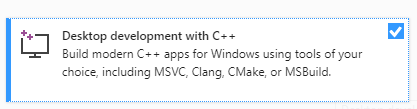
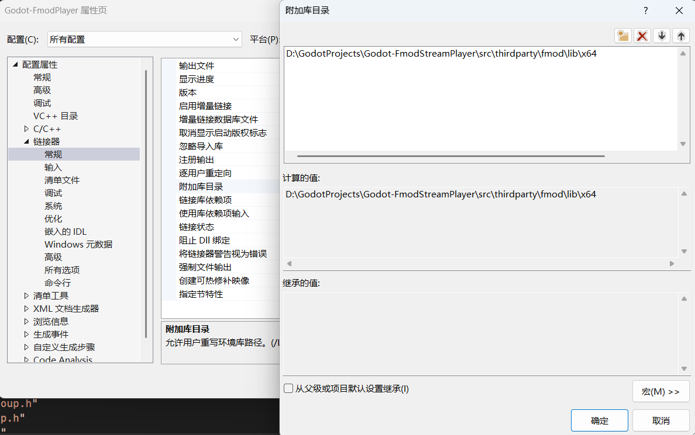

.. _contributing-development:

开发 Godot-FmodPlayer
=====================

本页面面向希望修改插件源码的贡献者。这里假设你已经了解 Godot 4 的 `C++ / GDExtension <https://docs.godotengine.org/zh-cn/4.x/tutorials/scripting/cpp/index.html>`_ 开发方式，并准备从 `Godot-FmodPlayer 仓库 <https://github.com/LuYingYiLong/Godot-FmodPlayer>`_ 开始工作。

准备环境
--------

开发前建议准备：

- Godot 4.x。
- Git。
- Python 3 与 SCons。
- 支持 C++17 的编译环境。
- FMOD Engine。
- Windows 开发建议使用 Visual Studio。

克隆仓库时请保留子模块：

.. code-block:: bash

    git clone --recursive https://github.com/LuYingYiLong/Godot-FmodPlayer.git
    cd Godot-FmodPlayer

如果已经克隆但忘记拉取子模块，可以执行：

.. code-block:: bash

    git submodule update --init --recursive

选择编辑器
----------

你可以使用任何文本编辑器开发 Godot-FmodPlayer，然后在命令行中调用 ``scons`` 构建。

如果你希望使用完整 IDE，Windows 上推荐 `Visual Studio <https://visualstudio.microsoft.com/>`_。它提供调试器、内存视图、性能分析、源码控制和解决方案管理，对调试 GDExtension 比较方便。

配置 Visual Studio
~~~~~~~~~~~~~~~~~~

`Visual Studio Community <https://visualstudio.microsoft.com>`_ 是 Microsoft 提供的 Windows IDE。个人开发者、开源项目和符合许可条件的组织可以免费使用。

安装 Visual Studio 时，请确保勾选 C++ 相关工作负载。通常需要安装 **使用 C++ 的桌面开发**：

导入项目
^^^^^^^^

可以通过下面任一方式打开项目：

- 双击仓库根目录下的 ``Godot-FmodPlayer.slnx``。
- 在 Visual Studio 中选择 **打开项目或解决方案**，然后选择 ``Godot-FmodPlayer.slnx``。

打开后，如果 IDE 没有正确识别 C++ 项目，先确认 C++ 工作负载和 Windows SDK 是否安装完整。

补齐 FMOD 运行库
----------------

由于 FMOD 许可证限制，Godot-FmodPlayer 仓库不会包含 FMOD Engine 的头文件和库文件。你需要前往 `FMOD 下载页面 <https://www.fmod.com/download>`_ 下载 FMOD Engine，并从本机安装目录复制 Core API 相关文件。

以 Windows 默认安装路径为例：

1. 找到 FMOD Core API 头文件目录：

   ``C:\Program Files (x86)\FMOD SoundSystem\FMOD Studio API Windows\api\core\inc``

2. 找到 FMOD Core API 库文件目录：

   ``C:\Program Files (x86)\FMOD SoundSystem\FMOD Studio API Windows\api\core\lib``

3. 将 ``inc`` 和 ``lib`` 复制到插件仓库的：

   ``src/thirdparty/fmod/``

整理完成后，目录结构应类似：

.. code-block:: text

    src/
    └── thirdparty/
        └── fmod/
            ├── inc/
            │   ├── fmod.h
            │   ├── fmod.hpp
            │   ├── fmod_common.h
            │   ├── fmod_codec.h
            │   ├── fmod_dsp.h
            │   ├── fmod_dsp_effects.h
            │   ├── fmod_errors.h
            │   └── fmod_output.h
            └── lib/
                ├── arm64/
                ├── x64/
                └── x86/

.. warning::

    不要把 FMOD 的 ``inc``、``lib`` 或运行库文件提交到仓库。它们只应该存在于你的本地开发环境中。

附加库目录
~~~~~~~~~~

构建插件
--------

Windows x86_64 调试构建示例：

.. code-block:: bash

    scons platform=windows target=template_debug arch=x86_64

Windows x86_64 发布构建示例：

.. code-block:: bash

    scons platform=windows target=template_release arch=x86_64

构建完成后，请确认生成的 GDExtension 二进制文件与 ``addons/fmod_player/bin/`` 中的 ``fmod_player.gdextension`` 配置匹配。

如果你修改了导出平台、架构或输出文件名，也要同步检查 ``fmod_player.gdextension`` 中的库路径。

代码风格
--------

代码风格以现有源码为准。提交前建议注意：

- 使用项目已有的命名方式和目录组织。
- C++ 代码保持 K&R 风格，左花括号跟随语句末尾。
- 指针和引用写法跟随当前文件，不为风格偏好单独重排代码。
- 避免无关格式化，尤其不要在功能 PR 中格式化整份文件。
- 新增绑定时，同步检查 GDScript 可见 API、文档和示例。

调试建议
--------

如果插件无法加载，优先检查：

- FMOD 运行库是否放在正确位置。
- ``fmod_player.gdextension`` 中的二进制路径是否匹配当前平台和架构。
- Godot 输出面板是否有 GDExtension 加载错误。
- Visual Studio 运行库和 Windows SDK 是否安装完整。
- Debug / Release 构建产物是否与当前 Godot 模板目标一致。

修改完成后，建议至少在 Godot 编辑器中创建一个最小场景，验证音频可以加载、播放和停止。如果改动涉及总线、DSP、3D 音频或导出流程，请补充对应的手动验证步骤。
