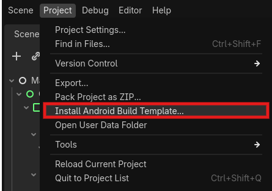

导出说明
========

本文说明如何在导出 Godot 项目时打包 Godot-FmodPlayer 和 FMOD 运行库。
如果你还没有完成插件安装，请先阅读 :doc:`getting_started/installation`。

导出前检查
----------

确认插件文件
~~~~~~~~~~~~

导出前，项目中应包含 ``addons/fmod_player`` 插件目录。Windows 项目通常至少需要：

.. code-block:: text

   res://
   └── addons/
       └── fmod_player/
           ├── plugin.cfg
           ├── fmod_check.gd
           ├── fmod_player_main.gd
           └── bin/
               ├── fmod_player.gdextension
               ├── fmod.dll
               ├── fmod_player.windows.template_debug.x86_64.dll
               ├── fmod_player.windows.template_release.x86_64.dll
               └── icons/

.. important::

   FMOD 运行库不会随插件一起分发。你需要自行从
   `FMOD 下载页面 <https://www.fmod.com/download>`_ 下载 FMOD Engine，
   并根据目标平台复制对应的运行库。

确认 GDExtension 配置
~~~~~~~~~~~~~~~~~~~~~

当前插件默认支持 Windows x86_64 和 Android arm64。``addons/fmod_player/bin/fmod_player.gdextension``
中应包含类似配置：

.. code-block:: ini

   [configuration]
   entry_symbol = "fmod_player_init"
   compatibility_minimum = "4.1"
   reloadable = true

   [libraries]
   windows.debug.x86_64 = "fmod_player.windows.template_debug.x86_64.dll"
   windows.release.x86_64 = "fmod_player.windows.template_release.x86_64.dll"
   android.debug.arm64 = "libfmod_player.android.template_debug.arm64.so"
   android.release.arm64 = "libfmod_player.android.template_release.arm64.so"

   [dependencies]
   windows.debug.x86_64 = { "fmod.dll" : "" }
   windows.release.x86_64 = { "fmod.dll" : "" }

如果你修改了二进制文件名、平台或架构，需要同步修改此文件。

Godot 导出预设
--------------

#. 打开 **项目 > 导出**。
#. 创建或选择目标平台的导出预设。
#. 在 **资源** 标签页中，确认 ``addons/fmod_player/`` 和音频资源会被包含。
#. 如果使用 Android，请启用 Gradle 构建并安装 Android 构建模板。

Windows 导出
------------

需要的文件
~~~~~~~~~~

Windows x86_64 发布版需要：

- ``addons/fmod_player/bin/fmod_player.gdextension``
- ``addons/fmod_player/bin/fmod_player.windows.template_release.x86_64.dll``
- ``addons/fmod_player/bin/fmod.dll``
- 项目中使用到的音频资源

.. note::

   发布版请使用 ``fmod.dll``。``fmodL.dll`` 是 FMOD 的日志/调试版本，通常不用于正式发布。
   当前插件的 Windows 依赖配置默认查找 ``fmod.dll``。

导出建议
~~~~~~~~

.. list-table::
   :header-rows: 1

   * - 设置项
     - 建议
   * - 架构
     - ``x86_64``
   * - 导出模板
     - 使用 release 模板进行正式发布
   * - 嵌入 PCK
     - 可按项目发布方式选择
   * - 首次验证
     - 先导出到空目录，确认缺失文件更容易排查

导出后检查
~~~~~~~~~~

运行导出的 ``.exe``，确认：

- 游戏能够正常启动。
- 没有 GDExtension 加载失败错误。
- 音频可以播放。
- 控制台或日志中没有 ``fmod.dll`` 缺失提示。

Android 导出
------------

Android 比 Windows 多一步：除了插件自己的 ``libfmod_player``，还要把 FMOD 的
``libfmod.so`` 和 ``fmod.jar`` 放进 Android 构建模板。

准备文件
~~~~~~~~

需要准备：

- ``addons/fmod_player/bin/libfmod_player.android.template_release.arm64.so``
- 从 FMOD Engine Android 包中取得的 ``libfmod.so``
- 从 FMOD Engine Android 包中取得的 ``fmod.jar``

.. seealso:: `为 Android 导出 <https://docs.godotengine.org/zh-cn/4.x/tutorials/export/exporting_for_android.html>`_ 如何为导出到 Android 做准备。

自动化配置
~~~~~~~~

为了简化 Android 导出流程，Godot‑FmodPlayer 提供了一个辅助工具：

仅当前项目只需要构建 FmodPlayer 时，打开 **项目 > 工具 > Configure FMOD Android Export**，该工具会：

- 自动安装 Android 构建模板（如尚未安装）
- 将 FMOD 运行库（`libfmod.so`、`fmod.jar`）复制到正确位置
- 自动修改 `build.gradle`，添加 `fmod.jar` 依赖
- 在 `GodotApp.java` 中注入 `System.loadLibrary("fmod")`

完成后即可进行 :ref:`set-android-export`。

若当前项目不止要构建 FmodPlayer，请完成接下来的步骤。

安装 Android 构建模板
~~~~~~~~~~~~~~~~~~~~~

在 Godot 中执行 **项目 > 安装 Android 构建模板**。

安装后，项目中会出现 ``res://android/build/`` 目录。

复制运行库
~~~~~~~~~~

将 Android arm64 运行库复制到 Gradle 工程的库目录。目录可以按项目需要组织，
但应保证最终 APK/AAB 中包含对应 ABI 的 ``.so`` 文件。

常见做法是放入：

.. code-block:: text

   res://android/build/libs/
   ├── debug/
   │   ├── arm64-v8a/
   │   │   ├── libfmod.so
   │   │   └── libfmod_player.android.template_debug.arm64.so
   └── release/
       └── arm64-v8a/
           ├── libfmod.so
           └── libfmod_player.android.template_release.arm64.so

实际目录可能会随 Godot 版本和模板结构不同而调整。关键是 ABI 必须匹配导出预设中的
``arm64-v8a``。

添加 fmod.jar
~~~~~~~~~~~~~

将 ``fmod.jar`` 放入：

.. code-block:: text

   res://android/build/libs/fmod.jar

然后在 ``res://android/build/build.gradle`` 的 ``dependencies`` 中加入：

.. code-block:: groovy

   dependencies {
       implementation files("libs/fmod.jar")
   }

加载 FMOD 库
~~~~~~~~~~~~

在 Android 启动代码中加载 FMOD 运行库。通常是在 ``GodotApp.java`` 的
``onCreate`` 中调用：

.. code-block:: java

   @Override
   public void onCreate(Bundle savedInstanceState) {
       System.loadLibrary("fmod");
       super.onCreate(savedInstanceState);
   }

.. note::

   如果你使用 FMOD 调试库，则库名可能是 ``fmodL``。发布版通常使用 ``fmod``。
   不要在同一个发布构建里同时加载 ``fmod`` 和 ``fmodL``。

.. _set-android-export:

导出设置
~~~~~~~~

#. 在 Android 导出预设中选择 ``arm64-v8a``。
#. 启用 Gradle 构建。

   .. image:: _static/use_gradle_build.png
      :align: center

#. 导出 APK 或 AAB。
#. 在真机上测试音频播放，不要只依赖编辑器或模拟器结果。

源码构建发布库
--------------

如果你修改了插件 C++ 源码，需要重新构建平台二进制。

Windows release：

.. code-block:: bash

   scons platform=windows target=template_release arch=x86_64

Android release：

.. code-block:: bash

   scons platform=android target=template_release arch=arm64

构建完成后，将生成的二进制复制到 ``addons/fmod_player/bin/``，并确认
``fmod_player.gdextension`` 中的文件名一致。

导出排错
--------

Windows 常见问题
~~~~~~~~~~~~~~~~

**导出后启动失败或提示找不到 GDExtension**

- 确认 ``fmod_player.gdextension`` 被包含在导出包中。
- 确认 release 版本的 ``fmod_player.windows.template_release.x86_64.dll`` 存在。
- 确认导出架构为 ``x86_64``。
- 确认 Godot 版本不低于插件要求的 ``4.1``。

**提示找不到 fmod.dll**

- 确认 ``addons/fmod_player/bin/fmod.dll`` 存在。
- 确认使用的是 Windows x86_64 的 FMOD Core 运行库。
- 尝试将 ``fmod.dll`` 与导出的可执行文件放在同一目录中，以排除运行时搜索路径问题。

Android 常见问题
~~~~~~~~~~~~~~~~

**启动后崩溃**

- 确认 ``libfmod.so`` 已打包进 APK/AAB。
- 确认 ABI 是 ``arm64-v8a``，并与 ``libfmod_player.android.template_release.arm64.so`` 匹配。
- 确认启动代码中已调用 ``System.loadLibrary("fmod")``。
- 使用 Logcat 查看原始错误。

**导出后没有声音**

- 确认音频资源被包含在导出包中。
- 优先使用 ``res://`` 路径，不要依赖开发机绝对路径。
- 检查 FMOD 初始化日志和 Godot 输出。

日志查看
~~~~~~~~

Windows 可以使用 Godot 控制台、编辑器输出面板，或从命令行启动导出的程序查看日志。

Android 可使用：

.. code-block:: bash

   adb logcat -s godot
   adb logcat | grep FMOD

发布前检查清单
--------------

Windows
~~~~~~~

- ``fmod_player.gdextension`` 已包含。
- ``fmod_player.windows.template_release.x86_64.dll`` 已包含。
- ``fmod.dll`` 已包含。
- 所有音频资源已包含。
- 在空目录中运行导出版本并测试播放。

Android
~~~~~~~

- Android 导出预设启用了 ``arm64-v8a``。
- 已启用 Gradle 构建。
- ``libfmod_player.android.template_release.arm64.so`` 已包含。
- ``libfmod.so`` 已打包到正确 ABI 目录。
- ``fmod.jar`` 已加入 Gradle 依赖。
- 启动代码已加载 FMOD 运行库。
- 已在真机上测试播放。

性能建议
--------

- 背景音乐和较长音频优先使用 ``MODE_STREAM``。
- 短音效、频繁触发的声音优先使用 ``MODE_SAMPLE``。
- 移动平台上谨慎使用大量实时 DSP，优先在总线上共享效果。
- 控制同时播放的通道数量，避免不必要的重叠播放。
- 发布前在目标设备上观察 ``FmodCPUUsage`` 和 ``FmodFileUsage`` 监视器。

许可与署名
----------

Godot-FmodPlayer 插件本身使用 `MIT 许可证 <https://opensource.org/license/MIT>`_。
FMOD Engine 是 Firelight Technologies Pty Ltd 的专有软件，使用和分发需要遵守
FMOD 官方许可条款。

发布前请阅读：

- `FMOD Licensing <https://www.fmod.com/licensing>`_
- `FMOD Legal Information <https://www.fmod.com/legal>`_
- `FMOD Attribution <https://www.fmod.com/attribution>`_

.. important::

   FMOD 的许可、价格和署名要求可能会更新。本文只说明 Godot-FmodPlayer 的导出配置，
   不替代 FMOD 官方许可文本。
