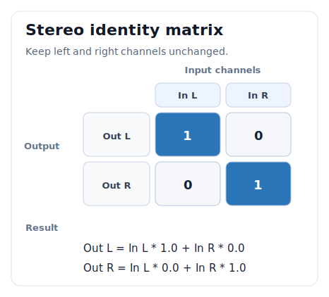
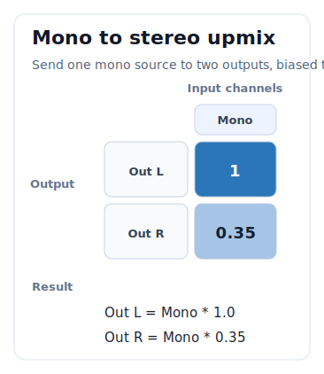
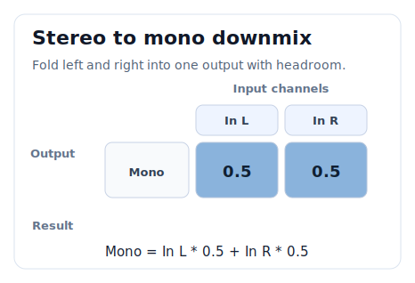
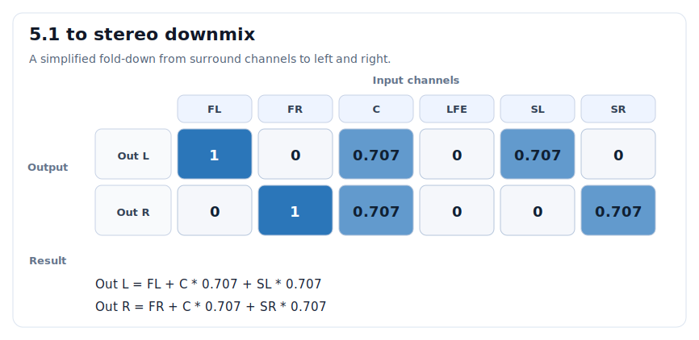

混音系统
========

Godot-FmodPlayer 提供专业级的混音系统，支持音频总线、通道组和实时参数调整。

核心概念
--------

音频总线（Audio Bus）
~~~~~~~~~~~~~~~~~~~~~

音频总线是混音系统的基本单元，用于组织和控制一组音频通道。每个总线都有自己的音量、效果和路由设置。

通道组（Channel Group）
~~~~~~~~~~~~~~~~~~~~~~~~

通道组是 FMOD 底层的混音概念，``FmodAudioBus`` 对其进行了包装，提供更友好的接口。

总线布局（Bus Layout）
~~~~~~~~~~~~~~~~~~~~~~

总线布局定义了项目中所有音频总线的结构，与 Godot 的 AudioServer 同步。

使用音频总线
------------

默认总线结构
~~~~~~~~~~~~

插件初始化时会创建与 Godot AudioServer 同步的总线结构::

    Master
    ├── Music
    ├── SFX
    ├── Voice
    └── Ambient

将声音路由到总线
~~~~~~~~~~~~~~~~

.. code-block:: gdscript

    extends Node

    @onready var player = $FmodAudioStreamPlayer

    func _ready():
        # Option 1: Use the node property.
        player.bus = "Music"

    func play_on_bus():
        # Option 2: Specify the bus when playing from code.
        var system = FmodServer.main_system
        var sfx_bus = system.get_channel_group_by_name("SFX")
        
        var sound = system.create_sound_from_file("res://sfx/hit.wav")
        var channel = system.play_sound(sound, sfx_bus, false)

控制总线参数
~~~~~~~~~~~~

.. code-block:: gdscript

    func control_bus():
        var system = FmodServer.main_system
        var music_bus = system.get_channel_group_by_name("Music")
        
        # Set volume in decibels.
        music_bus.set_volume_db(-12.0)
        
        # Mute the bus.
        music_bus.set_mute(true)
        
        # Solo this bus by muting other buses.
        music_bus.set_solo(true)
        
        # Pause all channels under this bus.
        music_bus.set_paused(true)

自定义总线布局
--------------

创建总线
~~~~~~~~

.. code-block:: gdscript

    func create_custom_bus():
        var layout = FmodServer.get_audio_bus_layout()
        
        # Create a new bus under Master.
        var ui_bus = layout.create_audio_bus("UI", "Master")
        
        # Set the initial volume.
        ui_bus.set_volume_db(-6.0)

嵌套总线
~~~~~~~~

.. code-block:: gdscript

    func create_nested_buses():
        var layout = FmodServer.get_audio_bus_layout()
        
        # Create child buses under SFX.
        var weapon_bus = layout.create_audio_bus("Weapons", "SFX")
        var footstep_bus = layout.create_audio_bus("Footsteps", "SFX")
        
        # Create the hierarchy.
        # Master -> SFX -> Weapons
        #            -> Footsteps

程序化总线管理
~~~~~~~~~~~~~~

.. code-block:: gdscript

    extends Node

    var bus_volumes: Dictionary = {}

    func _ready():
        # Save original volumes.
        save_bus_volumes()

    func save_bus_volumes():
        var system = FmodServer.main_system
        var master = system.get_master_channel_group()
        
        # Iterate over all child buses.
        var num_buses = master.get_num_groups()
        for i in range(num_buses):
            var bus = master.get_group(i)
            bus_volumes[bus.get_name()] = bus.get_volume_db()

    func mute_all_except(bus_name: String):
        var system = FmodServer.main_system
        var master = system.get_master_channel_group()
        
        var num_buses = master.get_num_groups()
        for i in range(num_buses):
            var bus = master.get_group(i)
            bus.set_mute(bus.get_name() != bus_name)

    func restore_all_buses():
        var system = FmodServer.main_system
        var master = system.get_master_channel_group()
        
        var num_buses = master.get_num_groups()
        for i in range(num_buses):
            var bus = master.get_group(i)
            var name = bus.get_name()
            if bus_volumes.has(name):
                bus.set_volume_db(bus_volumes[name])
            bus.set_mute(false)

混音技术
--------

.. _mixer-mix-matrix:

混音矩阵、上混音与下混音
~~~~~~~~~~~~~~~~~~~~~~~~

混音矩阵（Mix Matrix）用于控制 **输入声道** 如何分配到 **输出声道**。
可以把它理解成一张权重表：每一列是一个输入声道，每一行是一个输出声道，表格中的数值表示
“这个输入声道有多少信号送到这个输出声道”。

以一个立体声输入送到立体声输出为例：

这个矩阵表示左声道只进左扬声器，右声道只进右扬声器。用更直观的形式写就是：

.. code-block:: text

    输出 L = 输入 L * 1.0 + 输入 R * 0.0
    输出 R = 输入 L * 0.0 + 输入 R * 1.0

上混音
^^^^^^

上混音（Upmix）是把较少的输入声道分配到更多输出声道。例如把单声道音效送到立体声输出，
或者把立体声音乐送到 5.1 输出。

最常见的单声道到立体声上混音，是把同一份单声道信号同时送到左右声道。听感上它会位于正中间。
如果希望这个单声道声音偏左，可以降低右声道电平：

在 Godot-FmodPlayer 中，简单左右声像通常直接用
:ref:`FmodChannelControl.set_pan()<FmodChannelControl-set_pan>` 更方便。
只有在需要精确控制多声道分配时，才需要手动设置混音矩阵。

下混音
^^^^^^

下混音（Downmix）是把较多的输入声道折叠到较少输出声道。例如把立体声转为单声道，
或者把 5.1 输出到立体声设备。

一个常见的立体声到单声道下混矩阵如下：

这表示左右声道各取一半相加：

.. code-block:: text

    输出 Mono = 输入 L * 0.5 + 输入 R * 0.5

不要简单使用 ``1.0 + 1.0`` 做下混。两个满电平信号直接相加可能让输出超过正常范围，
造成削波或听感上的突然变大。实际项目里可以从 ``0.5``、``0.707`` 或更保守的值开始，
再根据素材响度和目标平台调整。

5.1 到立体声的简化示例
^^^^^^^^^^^^^^^^^^^^^^

5.1 声道通常可以按以下顺序理解：

.. code-block:: text

    Front Left, Front Right, Center, LFE, Surround Left, Surround Right

一个简化的 5.1 到立体声下混矩阵可以写成：

这里的思路是：

- 左前和右前分别进入对应的左右输出。
- 中置声道同时进入左右输出，并降低到 ``0.707``，避免居中内容过响。
- 左环绕进入左输出，右环绕进入右输出，也适当降低。
- LFE 是低频效果声道，不一定适合直接混入普通立体声输出，是否加入要看项目需求。

.. warning::

   多声道下混没有唯一正确答案。不同平台、设备、耳机虚拟环绕、影院标准和游戏风格可能需要不同矩阵。
   对关键内容做下混时，必须用实际目标设备听测。

在代码中设置混音矩阵
^^^^^^^^^^^^^^^^^^^^

:ref:`FmodChannelControl.set_mix_matrix()<FmodChannelControl-set_mix_matrix>` 接收一个
``PackedFloat32Array``，并指定输出声道数、输入声道数和输入声道步长。
矩阵按“输出行优先”的方式书写：先写输出 0 接收各输入的权重，再写输出 1，以此类推。

下面示例把立体声左右声道对调：

.. code-block:: gdscript

    func swap_stereo(channel: FmodChannel) -> void:
        var matrix := PackedFloat32Array([
            0.0, 1.0, # Out L = In R
            1.0, 0.0, # Out R = In L
        ])

        channel.set_mix_matrix(matrix, 2, 2)

下面示例把单声道上混到立体声，并让声音偏左：

.. code-block:: gdscript

    func mono_to_left_biased_stereo(channel: FmodChannel) -> void:
        var matrix := PackedFloat32Array([
            1.0,  # Out L = Mono * 1.0
            0.35, # Out R = Mono * 0.35
        ])

        channel.set_mix_matrix(matrix, 2, 1)

下面示例把立体声下混为单声道：

.. code-block:: gdscript

    func stereo_to_mono(channel: FmodChannel) -> void:
        var matrix := PackedFloat32Array([
            0.5, 0.5, # Out Mono = In L * 0.5 + In R * 0.5
        ])

        channel.set_mix_matrix(matrix, 1, 2)

如果你只是想调整单个播放实例的左右位置，优先使用
:ref:`FmodChannelControl.set_pan()<FmodChannelControl-set_pan>`。
如果你只是想整体调节输入或输出电平，可以先看
:ref:`FmodChannelControl.set_mix_levels_input()<FmodChannelControl-set_mix_levels_input>` 和
:ref:`FmodChannelControl.set_mix_levels_output()<FmodChannelControl-set_mix_levels_output>`。
混音矩阵更适合处理多声道格式转换、特殊声道路由、左右声道互换、单声道偏置和调试音频资产等场景。

淡入淡出
~~~~~~~~

.. code-block:: gdscript

    func fade_bus(bus_name: String, target_db: float, duration: float):
        var system = FmodServer.main_system
        var bus = system.get_channel_group_by_name(bus_name)
        
        var tween = create_tween()
        tween.set_trans(Tween.TRANS_LINEAR)
        tween.set_ease(Tween.EASE_IN_OUT)
        
        # Use a custom volume interpolation loop here.
        # ChannelGroup cannot be tweened directly.
        var start_db = bus.get_volume_db()
        var elapsed = 0.0
        
        while elapsed < duration:
            await get_tree().process_frame
            elapsed += get_process_delta_time()
            var t = elapsed / duration
            var current_db = lerp(start_db, target_db, t)
            bus.set_volume_db(current_db)

侧链压缩（Ducking）
~~~~~~~~~~~~~~~~~~~~

当语音播放时自动降低音乐音量：

.. code-block:: gdscript

    extends Node

    @onready var voice_player = $VoicePlayer
    var music_bus: FmodChannelGroup
    var normal_music_db: float = 0.0
    var ducked_music_db: float = -12.0

    func _ready():
        var system = FmodServer.main_system
        music_bus = system.get_channel_group_by_name("Music")
        normal_music_db = music_bus.get_volume_db()

    func play_voice(path: String):
        # Duck the music.
        duck_music(true)
        
        # Play the voice line.
        var system = FmodServer.main_system
        var voice_bus = system.get_channel_group_by_name("Voice")
        var sound = system.create_sound_from_file(path)
        var channel = system.play_sound(sound, voice_bus, false)
        
        # Wait until the voice line finishes.
        while channel.is_playing():
            await get_tree().process_frame
        
        # Restore the music volume.
        duck_music(false)

    func duck_music(duck: bool):
        var target_db = ducked_music_db if duck else normal_music_db
        fade_bus("Music", target_db, 0.3)

快照系统（Mix Snapshots）
~~~~~~~~~~~~~~~~~~~~~~~~~

保存和恢复混音状态：

.. code-block:: gdscript

    class_name MixSnapshot
    extends RefCounted

    var bus_volumes: Dictionary = {}
    var bus_effects: Dictionary = {}

    static func capture() -> MixSnapshot:
        var snapshot = MixSnapshot.new()
        var system = FmodServer.main_system
        var master = system.get_master_channel_group()
        
        var num_buses = master.get_num_groups()
        for i in range(num_buses):
            var bus = master.get_group(i)
            var name = bus.get_name()
            snapshot.bus_volumes[name] = bus.get_volume_db()
        
        return snapshot

    func apply(duration: float = 0.0):
        var system = FmodServer.main_system
        
        for bus_name in bus_volumes:
            var bus = system.get_channel_group_by_name(bus_name)
            if bus:
                if duration > 0:
                    # Apply a tweened transition here.
                    pass  # Implement fade interpolation.
                else:
                    bus.set_volume_db(bus_volumes[bus_name])

# Usage example
var gameplay_snapshot: MixSnapshot
var pause_snapshot: MixSnapshot

func _ready():
    gameplay_snapshot = MixSnapshot.capture()
    
    # Create the mix state used while paused.
    var system = FmodServer.main_system
    var music = system.get_channel_group_by_name("Music")
    var sfx = system.get_channel_group_by_name("SFX")
    
    music.set_volume_db(-6.0)
    sfx.set_mute(true)
    
    pause_snapshot = MixSnapshot.capture()
    
    # Restore the gameplay state.
    gameplay_snapshot.apply()

func on_game_paused():
    pause_snapshot.apply(0.5)  # 0.5 second transition

func on_game_resumed():
    gameplay_snapshot.apply(0.5)

性能监控
--------

使用 Godot Performance 监视器查看混音性能：

.. code-block:: gdscript

    func _process(delta):
        # Get CPU usage.
        var dsp_usage = Performance.get_monitor("FmodCPUUsage/DSP")
        var stream_usage = Performance.get_monitor("FmodCPUUsage/Stream")
        
        # Get channel statistics.
        var system = FmodServer.main_system
        var channels = system.get_channels_playing()
        
        print("DSP: %.2f%% | Real channels: %d | Virtual: %d" % [
            dsp_usage,
            channels["real"],
            channels["virtual"]
        ])

最佳实践
--------

#. **规划总线结构** - 在项目早期设计好总线层级
#. **标准化命名** - 使用统一的命名规范（如 "Music", "SFX", "Voice"）
#. **默认音量归一化** - 所有总线默认 0 dB，通过调整音频文件本身来平衡
#. **使用快照管理状态** - 为不同游戏状态（游戏、暂停、菜单）创建混音快照
#. **避免过多总线** - 总线过多会增加 CPU 开销，保持简洁的层级结构

注意事项
--------

- 总线布局与 Godot AudioServer 同步，修改一个会影响另一个
- 通道组可以嵌套，但建议保持层级不要太深
- 静音和独奏是独立的状态，可以同时设置
- 3D 衰减在通道级别计算，在总线级别混合
